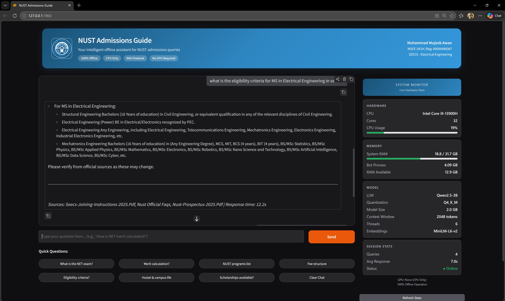
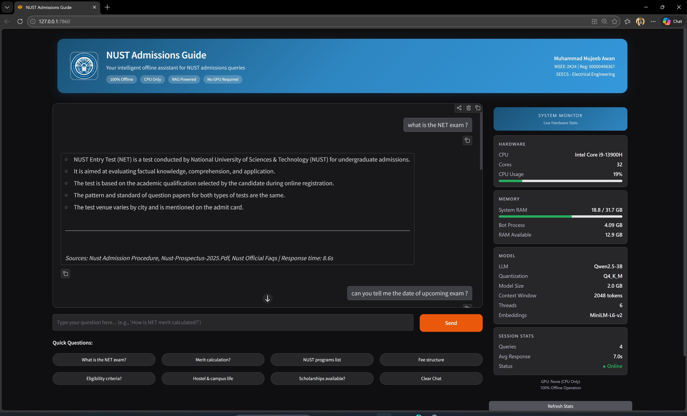
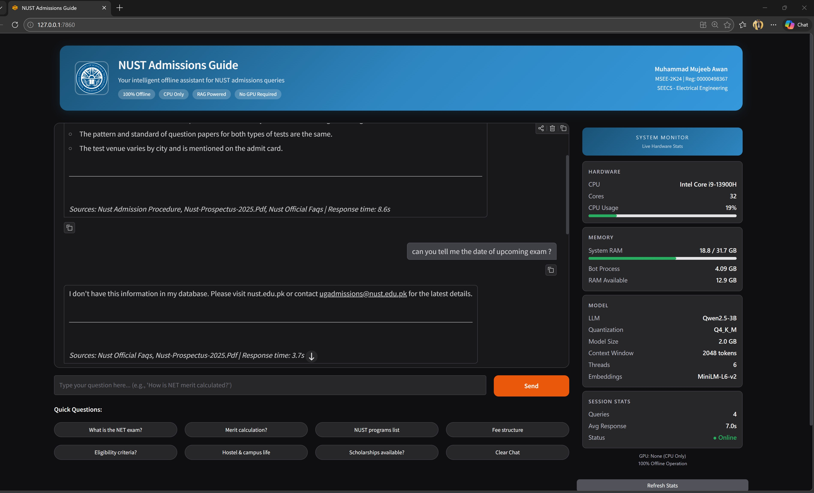

# NUST Admissions Guide - Offline Chatbot

An offline, RAG-powered admissions chatbot for NUST (National University of Sciences and Technology) that runs entirely on student hardware — no internet, no GPU, no cloud APIs.

Built for the **NUST Islamabad Local Chatbot Competition 2026**.

## Demo

### Answering Eligibility Criteria


### NET Exam Information


### Honest Uncertainty — Says "I Don't Know" Instead of Hallucinating


## Architecture

```
User Question
      │
      ▼
┌─────────────┐     ┌──────────────────┐
│  Embedding  │────▶│  FAISS Vector DB │
│  (MiniLM)   │     │  (1070 chunks)   │
└─────────────┘     └──────┬───────────┘
                           │ Top-5 chunks
                           ▼
                    ┌──────────────────┐
                    │   Qwen2.5-3B     │
                    │  (Q4_K_M GGUF)   │
                    │   CPU Inference   │
                    └──────┬───────────┘
                           │
                           ▼
                    ┌──────────────────┐
                    │  Gradio Chat UI  │
                    └──────────────────┘
```

## Data Sources

All data is sourced from **official NUST channels**:
- 74 FAQ Q&A pairs scraped from [nust.edu.pk/faqs/](https://nust.edu.pk/faqs/)
- 12 official NUST PDFs (prospectus, fee policy, eligibility criteria, NET subjects, hostel rates, etc.)
- Official admissions pages (merit criteria, admission procedure, fee structure)

## Design Tradeoffs

| Decision | Choice | Why |
|----------|--------|-----|
| LLM | Qwen2.5-3B Q4_K_M | Best quality-to-size ratio for CPU; 2.0GB fits in 8GB RAM |
| Embeddings | all-MiniLM-L6-v2 | Only 80MB, fast on CPU, excellent semantic search |
| Vector Store | FAISS | Zero-dependency, fast similarity search, no server needed |
| Quantization | Q4_K_M | Sweet spot between quality and speed |
| Context | 2048 tokens | Enough for RAG context + answer; keeps inference fast |
| Retrieval | Top-5 chunks | Balances context richness vs. inference speed |
| UI | Gradio | Clean, responsive, zero-config, works offline |

## Hardware Requirements

- **RAM:** 4-6 GB (model ~2.0GB + embeddings ~80MB + OS overhead)
- **CPU:** Any modern CPU (optimized for i5 13th gen)
- **GPU:** Not required
- **Storage:** ~3 GB for model + data
- **Internet:** Only needed for initial setup (downloading model)

## Quick Start

### 1. Install Dependencies
```bash
pip install -r requirements.txt
```

### 2. Download the LLM Model
```bash
python download_model.py
```
This downloads Qwen2.5-3B (Q4_K_M, ~2.0GB) from HuggingFace.

### 3. Build the Knowledge Base
```bash
python ingest.py
```
This processes the admissions data and builds the FAISS vector index.

### 4. Launch the Chatbot
```bash
python app.py
```
Opens at http://127.0.0.1:7860

## Key Features

- **100% Offline:** After initial setup, no internet needed
- **Official Data Only:** All answers sourced from nust.edu.pk and official PDFs
- **Transparent:** Shows source documents and response time for every answer
- **Honest:** Explicitly says "I don't have this information" instead of hallucinating
- **Fast:** Optimized CPU inference with quantized model and batch processing
- **Extensible:** Add new data by dropping files in `data/raw/` and re-running `python ingest.py`

## Project Structure

```
ChatBot/
├── app.py              # Gradio UI with system monitor
├── rag.py              # RAG pipeline (retrieval + generation)
├── ingest.py           # Data ingestion and vector store builder
├── config.py           # All configuration in one place
├── download_model.py   # Model downloader
├── benchmark.py        # Performance benchmarking
├── requirements.txt    # Python dependencies
├── screenshots/        # Demo screenshots
├── data/
│   ├── raw/            # Official NUST text data (scraped)
│   ├── pdfs/           # Official NUST PDF documents
│   └── vector_store/   # FAISS index (auto-generated)
└── models/
    └── model.gguf      # LLM model (auto-downloaded)
```

---

*Built by Muhammad Mujeeb Awan (MSEE-2K24, SEECS) for the NUST Islamabad Local Chatbot Competition 2026*
*Runs entirely offline on student hardware (8GB RAM, Core i5, no GPU)*
